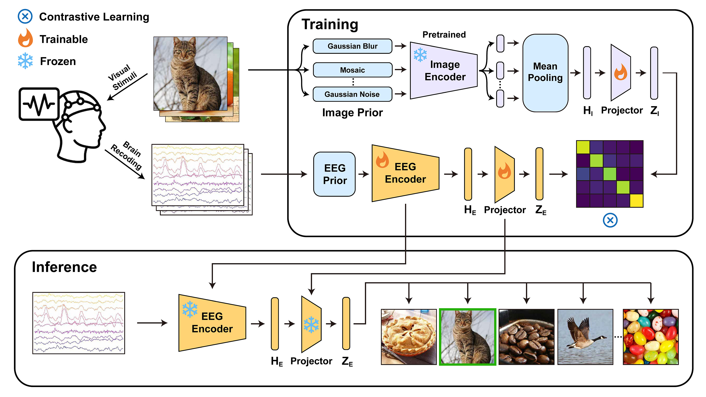

# NeuroBridge
This is the official implementation for NeuroBridge.


## Environment Setup

- Python 3.12.2
- CUDA 12.6
- PyTorch 2.6.0

Create conda environment:
```bash
conda create -n neurobridge python==3.12.2 -y
conda activate neurobridge
```
Install required depencencies:
```bash
pip install -r requirements.txt
```

## Data Preparation
Download the Things-EEG from [OSF repository](https://osf.io/y63gw/files) (Image) and [OSF repository](https://osf.io/crxs4/) (EEG), Things-MEG from [OSF repository](https://osf.io/jum2f/files/rdxy2) (Image) and [OpenNeuro](https://openneuro.org/datasets/ds004212/versions/2.0.1) (MEG). Either dataset can be downloaded and trained individually. Organize the data according to the following directory structure:

Things-EEG (126G)

```
data
├── things_eeg
│   ├── image_set
│   │   ├── train_images
│   │   └── test_images
│   └── raw_eeg
│       ├── sub-01
│       ├── ...
│       └── sub-10
```

Things-MEG (13G)

```
data
├── things_eeg
│   ├── image_set
│   │   └── object_images
│   ├── raw_meg
│   │   ├── preprocessed_P1-epo.fif
│   │   ├── ...
│   │   └── preprocessed_P4-epo.fif
│   ├── sourcedata
│   │   ├── sample_attributes_P1.csv
│   │   ├── ...
│   │   └── sample_attributes_P4.csv
```

The EEG and MEG data can be obtained using the provided download scripts, whereas the image data must be downloaded manually.

```Bash
# Things-EEG
/bin/bash scripts/things_eeg/download_eeg.sh
```

```Bash
# Things-MEG
/bin/bash scripts/things_meg/download_meg.sh
```
**Optional:**

We also provide preprocessed EEG and MEG data, as well as extracted image features that can be directly used for model training, which are available for download at (Coming soon).

Organize the preprocessed data according to the following directory structure:

Things-EEG

```
data
├── things_eeg
│   ├── preprocessed_eeg
│   └── image_feature
```

Things-MEG

```
data
├── things_eeg
│   ├── preprocessed_meg
│   └── image_feature
```

## Data Preprocessing
Execute the following code to perform preprocessing on the raw EEG and MEG data:

```Bash
# Things-EEG
python preprocess_eeg.py --mvnn
```

```Bash
# Things-MEG
python preprocess_meg.py
```

## Extract Image Feature and Fuse
Run the script below to extract image features using OpenCLIP:

```Bash
# Things-EEG
/bin/bash scripts/things_eeg/image_feature_extract.sh
```

```Bash
# Things-MEG
/bin/bash scripts/things_meg/image_feature_extract.sh
```

## Run
To run the experiments using the provided configurations, execute the following scripts.

Intra-subject: train and test on one subject

```Bash
# Things-EEG
/bin/bash scripts/things_eeg/intra-subjects.sh
```

```Bash
# Things-MEG
/bin/bash scripts/things_meg/intra-subjects.sh
```

Inter-subject: leave one subject out for test

```Bash
# Things-EEG
/bin/bash scripts/things_eeg/inter-subjects.sh
```

```Bash
# Things-MEG
/bin/bash scripts/things_meg/inter-subjects.sh
```

## Acknowledge
- [A large and rich EEG dataset for modeling human visual object recognition](https://www.alegifford.com/projects/eeg_dataset/) [THINGS-EEG]
- [THINGS-data, a multimodal collection of large-scale datasets for investigating object representations in human brain and behavior](https://elifesciences.org/articles/82580) [THINGS-MEG]
- [Decoding Natural Images from EEG for Object Recognition](https://github.com/eeyhsong/NICE-EEG) [NICE, ICLR 2024]
- [Visual Decoding and Reconstruction via EEG Embeddings with Guided Diffusion](https://github.com/dongyangli-del/EEG_Image_decode) [ATM, NeurIPS 2024]
- [CognitionCapturer: Decoding Visual Stimuli From Human EEG Signal With Multimodal Information](https://github.com/XiaoZhangYES/CognitionCapturer) [CognitionCapturer, AAAI 2025]
- [Bridging the Vision-Brain Gap with an Uncertainty-Aware Blur Prior](https://github.com/HaitaoWuTJU/Uncertainty-aware-Blur-Prior) [UBP, CVPR 2025]